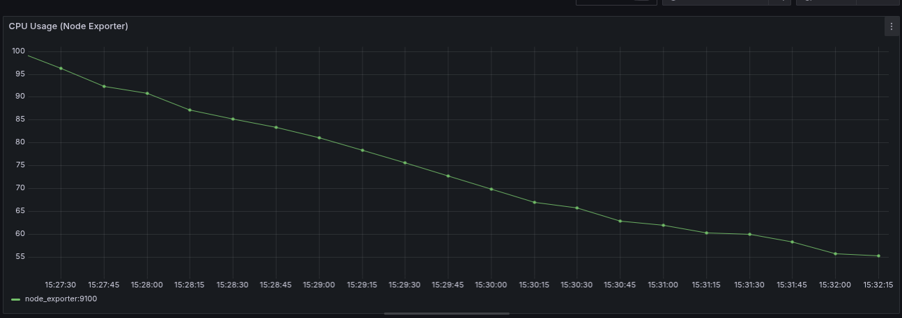
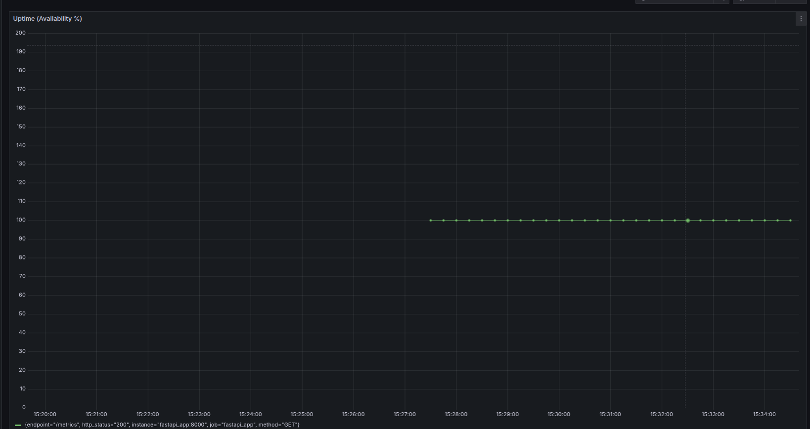
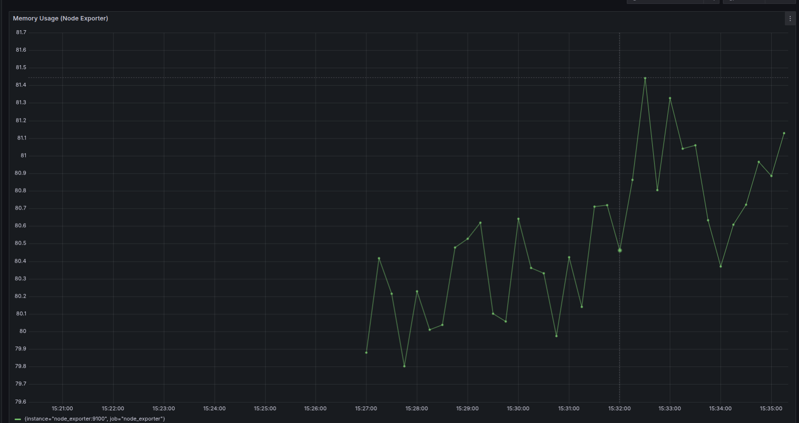
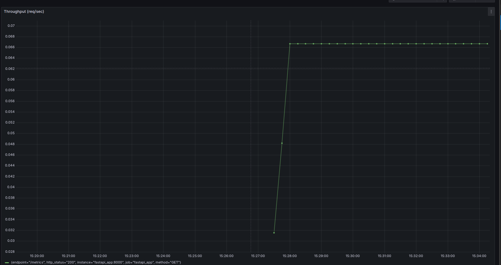

# Prometheus & Grafana Monitoring Dashboards

This directory contains Grafana dashboard screenshots showing various metrics from our EKS cluster monitoring setup.

## 📊 CPU Usage

*Dashboard showing cluster-wide CPU utilization patterns and resource consumption metrics*

## ⏱️ Application Uptime

*Displays service availability and uptime metrics across different components*

## 💾 Memory Usage

*Visualization of memory consumption patterns and allocation across pods/nodes*

## 🔄 Throughput

*Network throughput metrics showing request/response patterns and data transfer rates*

## Dashboard Details

These dashboards are configured using:
- Prometheus as the data source
- Grafana v9.x for visualization
- 5-minute refresh intervals